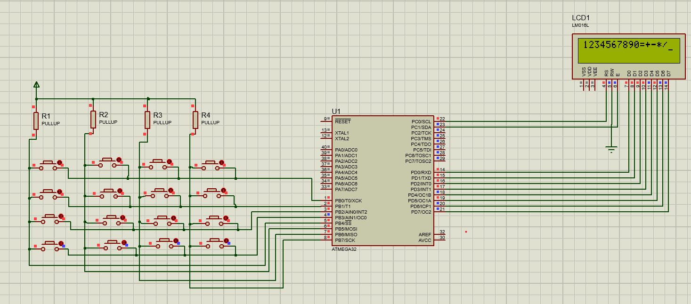

# AVR Keypad Interfacing with LCD ⚡

This project demonstrates how to interface a **4x4 matrix keypad** with an LCD using an AVR microcontroller (ATmega32). When you press a key on the keypad, its corresponding value is displayed on the LCD screen.

---

## 💡 Features

- 4x4 matrix keypad scanning
- LCD display (16x2)
- Supports numbers (0–9) and arithmetic operators (+, −, *, /, =)
- Written in C using AVR-GCC

---

## 🔌 Hardware Connections

### LCD (16x2)

| LCD Pin | MCU Pin (ATmega32) |
|-----------|-------------|
| RS        | PC1        |
| E         | PC0        |
| D0–D7     | PD0–PD7 |

---

### Keypad

| Keypad Lines | MCU Pin |
|---------------|---------|
| Row 1–4      | PB0–PB3 (outputs) |
| Column 1–4   | PB4–PB7 (inputs with pull-up resistors) |

---

## ⚙️ MCU Pin Configuration

```c
DDRC = 0xFF;  // LCD control lines as output
DDRD = 0xFF;  // LCD data lines as output
DDRB = 0x0F;  // PB0–PB3 outputs (rows), PB4–PB7 inputs

## 📝 How It Works
Rows are driven low one at a time, while columns are scanned to detect key presses.

When a key press is detected, the corresponding character is sent to the LCD.

Supports automatic debounce using simple while loops.

## 💻 Code

```c

#include <avr/io.h>
#include <util/delay.h>

void command(char a);
void data(char a);

int main()
{ 
    DDRC = 0xFF;
    DDRB = 0x0F;
    DDRD = 0xFF;
    command(0x38);
    command(0x80);
    command(0x01);
    command(0x06);
    command(0x0F);
    
    while(1)
    {
        PORTB = 0x0E; // First row
        if((PINB & 0x10) == 0) { data('1'); while((PINB & 0x10) == 0); }
        if((PINB & 0x20) == 0) { data('2'); while((PINB & 0x20) == 0); }
        if((PINB & 0x40) == 0) { data('3'); while((PINB & 0x40) == 0); }
        if((PINB & 0x80) == 0) { data('+'); while((PINB & 0x80) == 0); }

        PORTB = 0x0D; // Second row
        if((PINB & 0x10) == 0) { data('4'); while((PINB & 0x10) == 0); }
        if((PINB & 0x20) == 0) { data('5'); while((PINB & 0x20) == 0); }
        if((PINB & 0x40) == 0) { data('6'); while((PINB & 0x40) == 0); }
        if((PINB & 0x80) == 0) { data('-'); while((PINB & 0x80) == 0); }

        PORTB = 0x0B; // Third row
        if((PINB & 0x10) == 0) { data('7'); while((PINB & 0x10) == 0); }
        if((PINB & 0x20) == 0) { data('8'); while((PINB & 0x20) == 0); }
        if((PINB & 0x40) == 0) { data('9'); while((PINB & 0x40) == 0); }
        if((PINB & 0x80) == 0) { data('*'); while((PINB & 0x80) == 0); }

        PORTB = 0x07; // Fourth row
        if((PINB & 0x10) == 0) { command(0x01); }
        if((PINB & 0x20) == 0) { data('0'); while((PINB & 0x20) == 0); }
        if((PINB & 0x40) == 0) { data('='); while((PINB & 0x40) == 0); }
        if((PINB & 0x80) == 0) { data('/'); while((PINB & 0x80) == 0); }
    }
}

void command (char a)
{
    PORTC = 0x02;
    PORTD = a;
    _delay_ms(100);
    PORTC = 0x00;
}
void data(char a)
{
    PORTC = 0x03;
    PORTD = a;
    _delay_ms(100);
    PORTC = 0x01;
}

```

## 🖥️ Proteus Simulation
Below is the schematic diagram for simulation (Proteus example):



## 🛠️ Requirements
Atmel Studio or AVR-GCC toolchain

Proteus Design Suite (for simulation)

Basic understanding of keypad scanning and LCD interfacing

## 📝 License
This project is open-source under the MIT License. Feel free to modify and use it for your own learning or embedded systems projects.

## 🚀 Happy coding and experimenting!