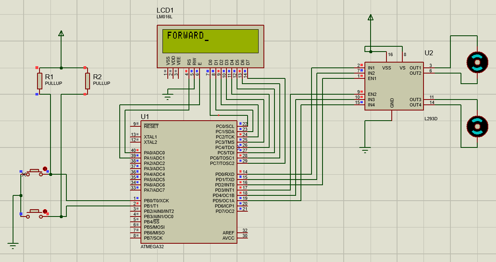

# ATmega32 Motor Control with LCD Display 📟

This project demonstrates controlling a DC motor using an **ATmega32 microcontroller**, two push buttons, and an **L293D motor driver IC**, with real-time status display on a 16x2 LCD.

---

## 💡 **Overview**

- **Microcontroller**: ATmega32
- **Motor Driver**: L293D
- **Display**: 16x2 LCD (LM016L)
- **Inputs**: 2 push buttons (for forward and reverse control)

---

## ⚙️ **Features**

- **Forward and Reverse motor control** using push buttons
- Real-time status messages ("FORWARD" or "REVERSE") displayed on LCD
- Automatic motor stop after a short delay
- Simple and clean Proteus simulation schematic included

---

## 🛠️ **Circuit Connections**

### ✅ LCD (16x2)

| LCD Pin | Connection  |
|-----------|-------------|
| VSS       | GND         |
| VDD       | +5V        |
| VEE       | Potentiometer for contrast |
| RS        | PA1        |
| RW        | GND        |
| E         | PA0        |
| D0-D7     | PC0-PC7    |

---

### ✅ Push Buttons

| Button    | Connected to |
|-------------|-------------|
| Forward Btn | PB0         |
| Reverse Btn | PB1         |

Both buttons are connected with **pull-up resistors**.

---

### ✅ L293D Motor Driver

| Pin         | Connection    |
|---------------|---------------|
| IN1, IN2, EN1 | PD pins (PORTD logic for forward/reverse) |
| OUT1, OUT2    | Motor A     |
| IN3, IN4, EN2 | PD pins if second motor used |
| OUT3, OUT4    | Motor B     |
| VSS          | +5V logic supply |
| VS           | Motor supply voltage (e.g., +9V or +12V) |
| GND          | GND         |

---

## 💻 **Code Explanation**

```c
#include <avr/io.h>
#include <util/delay.h>

// Function to send command to LCD
void command(int cmd) {
    PORTA = 0x02;      // RS = 0 (command), E = 1
    PORTC = cmd;       // Put command on PORTC
    _delay_ms(2);
    PORTA = 0x00;      // E = 0 (latch command)
    _delay_ms(2);
}

// Function to send data (character) to LCD
void data(char data) {
    PORTA = 0x03;      // RS = 1 (data), E = 1
    PORTC = data;      // Put data on PORTC
    _delay_ms(2);
    PORTA = 0x01;      // E = 0 (latch data)
    _delay_ms(2);
}

// Function to move motors forward
void forward() {
    PORTD = 0x1D;      // Set motor control pins to forward
}

// Function to move motors reverse
void reverse() {
    PORTD = 0x2E;      // Set motor control pins to reverse
}

// Function to stop motors
void stop() {
    PORTD = 0x00;      // All motor control pins low
}

// Function to display string on LCD
void display(const char *p) {
    while (*p != 0) {  // Loop until null character
        data(*p);      // Send each character to LCD
        p++;           // Move to next character
    }
}

void main(void) {
    DDRD = 0xFF;       // PORTD as output for motor control
    DDRB = 0x00;       // PORTB as input for push buttons
    DDRC = 0xFF;       // PORTC as output for LCD data
    DDRA = 0xFF;       // PORTA as output for LCD control signals

    _delay_ms(20);     // LCD power-on delay

    // LCD initialization
    command(0x38);     // 8-bit mode, 2 lines, 5x7 matrix
    command(0x0E);     // Display ON, cursor ON
    command(0x06);     // Increment cursor
    command(0x01);     // Clear display

    while (1) {
        if ((PINB & 0x01) == 0) {  // Check if first button pressed (PB0)
            forward();
            command(0x80);          // Move cursor to start of first line
            display("FORWARD");
            _delay_ms(200);        // Delay to show text
            stop();
            command(0x01);         // Clear display
        } 
        else if ((PINB & 0x02) == 0) { // Check if second button pressed (PB1)
            reverse();
            command(0x80);          // Move cursor to start of first line
            display("REVERSE");
            _delay_ms(200);        // Delay to show text
            stop();
            command(0x01);         // Clear display
        } 
        else {
            stop();  // Default state: motors stopped
        }
    }
}


``` 
## 🗺️ Schematic



 ## 🚀 How to Implement
 ```
1️⃣ Write and compile the code using Atmel Studio or AVR GCC.
2️⃣ Flash the hex file to ATmega32 using a programmer (e.g., USBasp).
3️⃣ Connect the hardware as per schematic or simulate in Proteus.
4️⃣ Press buttons to test forward and reverse actions.
5️⃣ Watch real-time status on LCD.
```
## 📝 License
Open-source under MIT License. Feel free to use, modify, and share!

## 🎉 Happy Building!
